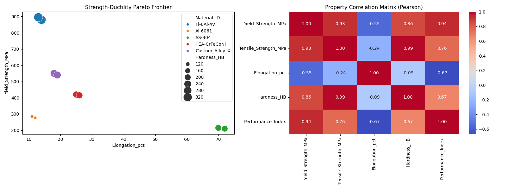

# Material-Informatics-Selection
Automated EDA tool for material property analysis and Pareto optimization.
# Project Overview
This project bridges Mechanical Engineering and Data Science by providing a computational framework to automate the Exploratory Data Analysis (EDA) of experimental material datasets. 

## Key Features
- **Pareto Frontier Mapping:** Visualizes the trade-off between Yield Strength and Ductility.
- **Correlation Heatmap:** Statistical analysis of property dependencies (Pearson coefficients) to identify key performance drivers.
- **Performance Indexing:** Automatically ranks materials based on custom strength-to-weight ratios.

## Results

## Technical Stack
- **Language:** Python 3.x
- **Libraries:** Pandas, Matplotlib, Seaborn
